# ANDROID环境变量及虚拟机

## 一、检测JDK版本

1.未安装JDK的，可到Oracle官网http://www.oracle.com/technetwor/java/javase/downloads/index.html下载并安装JDK SE 6.0或者更高版本。安装JDK之后，在控制台输入命令 ```java -version ``` 就可以显示版本号了

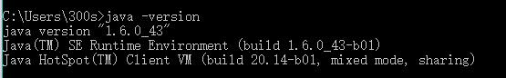

2.已安装JDK但是很久没有用的，可以先检查一下自己的java版本，同样是在控制台输入命令```java -version``` 看到版本号就可以知道java是否能够用了。

* 我是在之前安装的JDK，但是这次却检查不到JAVA版本了，于是我第一时间去看了环境变量。发现环境变量都配置好的，后来才发现是** 用户变量 ** 的**PATH ** 里面没有加上安装Java的地址。加上地址后就成功了。

## 二、安装Andorid SDK

1.安装Android SDK主安装包。从谷歌官方网站 **http://dl.google.com/android/android-sdk_r22.2.1-windows.zip **下载sdk主安装包。下载后直接解压缩到指定文件夹即可。

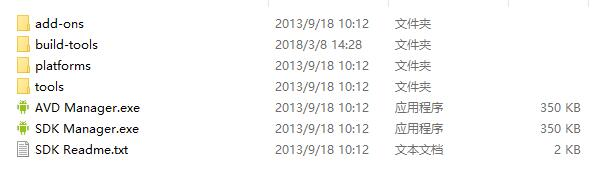

2.安装Android平台。从** http://dl-ssl.google.com/android/repository/android-14_r01.zip** 下载文件，下载后解压缩文件到platforms中。

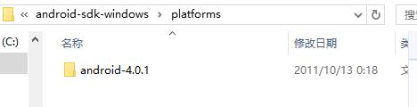

3.安装平台通用工具。从官网下载**http://dl-ssl.google.com/android/repository/platform-tools_r14-windows.zip** ,下载后解压缩到主安装包的文件夹里。

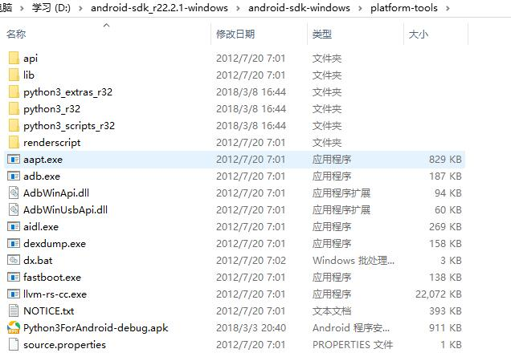

4.安装应用发布工具。先建立一个build-tools 文件夹，然后从官方网站**http://dl-ssl.google.com/android/repository/build-tools_r17-windows.zip** ，下载后解压缩在build-tools文件夹里。

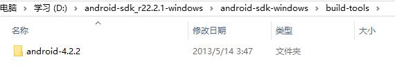

5.安装硬件系统映像文件。先新建一个system-images/android-14文件夹，然后解压缩下载的文件sysimg_armv7a-14_r01.zip，并复制到这个文件夹。

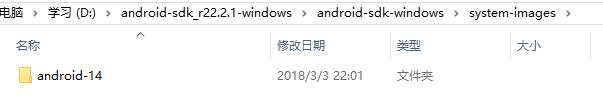

6.设置环境变量。

* 在环境变量里** path **的末尾加入以下内容：```D:\android-sdk_r22.2.1-windows\android-sdk-windows\tools;D:\D:\android-sdk_r22.2.1-windows\android-sdk-windows\platform-tools```

* 新建环境变量ANDROID_SDK_HOME:```D:\android-sdk_r22.2.1-windows\android-sdk-windows```

## 三、安装Android模拟器

1.打开SDK Manager.exe

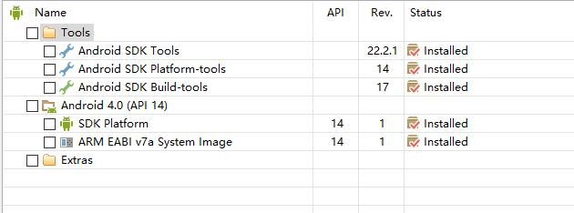

如图右边都是** Installed **，就表示所有的包都下载完成了。如不显示Installed，还应该点击 ** Install packages **  。

2.点击** Tools-Options **,在 ** Force http://...sources to be fetched using http://... **,再点击** close **。

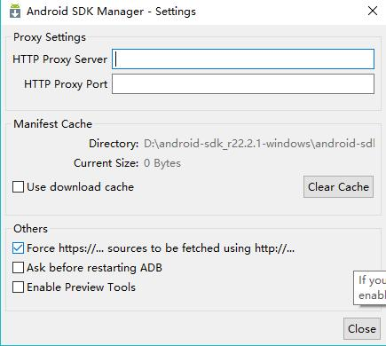

3.点击** Tools-Manage AVDs **,就可以配置AVD的参数。

4.打开AVD Manager.exe，点击**New**,然后加入参数。

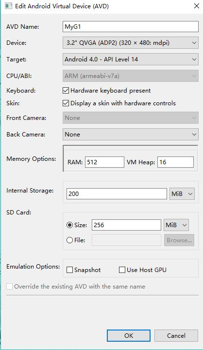

5.点击右侧的** Start **,再点击 ** Launch **

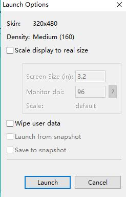

等待安卓虚拟机启动


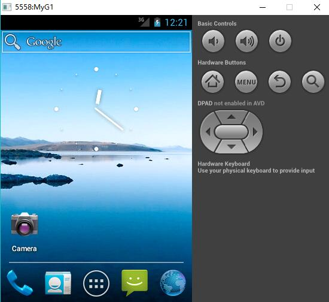

