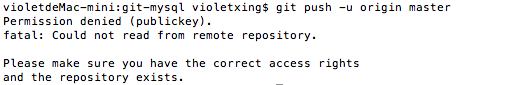
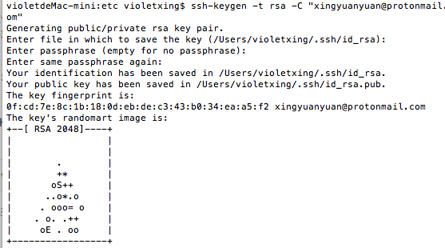
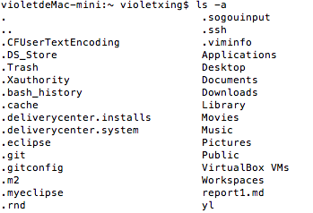
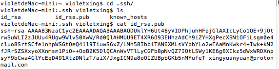
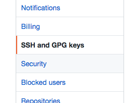
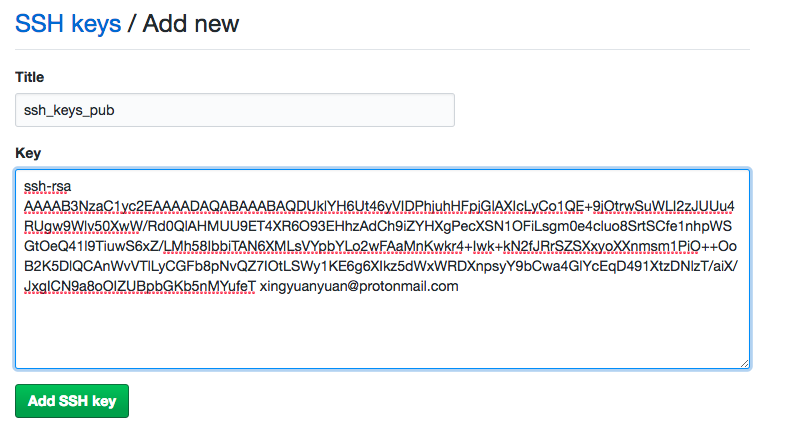

# 关于上传github的过程问题

## 出现Permission denied解决问题

1.在新建的mysql仓库里面上传文件，但是发现出现以下代码：

```
Permission denied (publickey)
```



在浏览器里搜了这条报错代码，发现是github账号没有设置ssh公钥信息所致。
所以接下来就要开始设置公钥信息了

2.先生成密钥

```
ssh-keygen -t rsa -C "邮箱地址"
```



3.接下来查看SSH配置文件并切换到用户目录

```
ls -a
```



4.进入.ssh目录并查看生成的公钥

```
cd .ssh/
```

看到有三个文件夹，其中id_rsa是密钥，id_rsa.pub是公钥。查看公钥信息。

```
ls
```

```
cat id_rsa.pub
```



接下来把这一段信息全部复制下来

5.进入github主页的设置页面点击**Edit profile**


6.选择**SSH and GPG keys**



7.右上角有个**New  SSH key**点击它，并粘贴公钥


8.粘贴好后就是这样的界面




