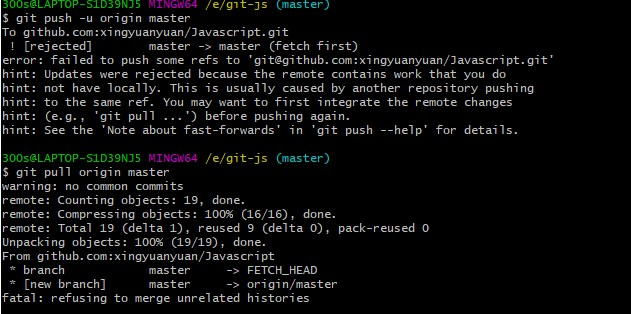
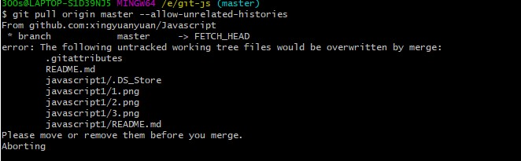
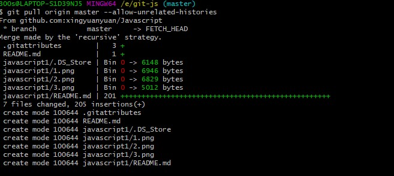
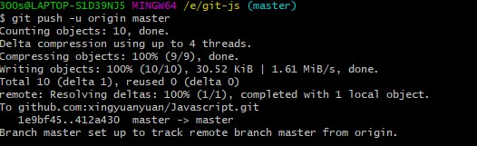

# 关于github出现的过程问题（三）

由于重新建了一个文件夹上传仓库，所以出了一些小问题。(在此之前，需要设置公钥和下载之前仓库里的所有文件)



在错误的原因里有一句： refusing to merge unrelated histories

因为他们是两个不同的项目，要把两个不同的项目合并，git需要添加一句代码，在git pull后面加上--allow-unrelated-histories

```
git pull orign master --allow-unrelated-histories
```



根据提示：Please move or remove them before you merge.
所以我们可以把以上提到的所有文件删除

再pull一次：



接下来再push:



就上传成功啦！